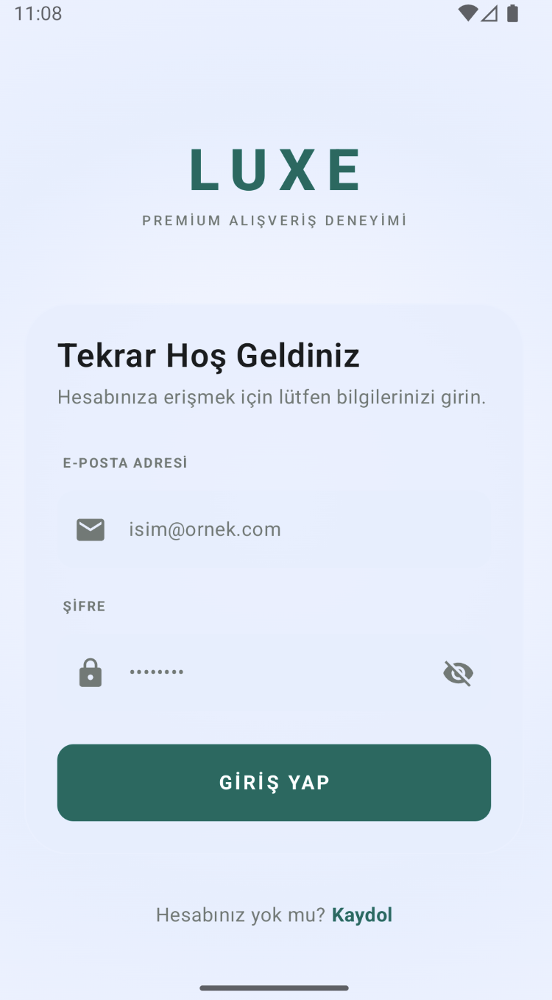
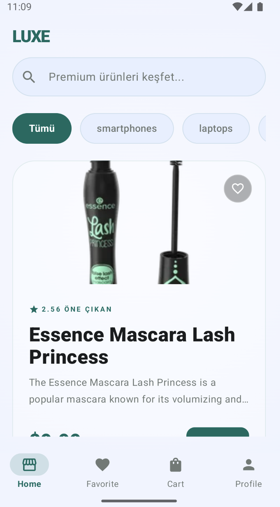
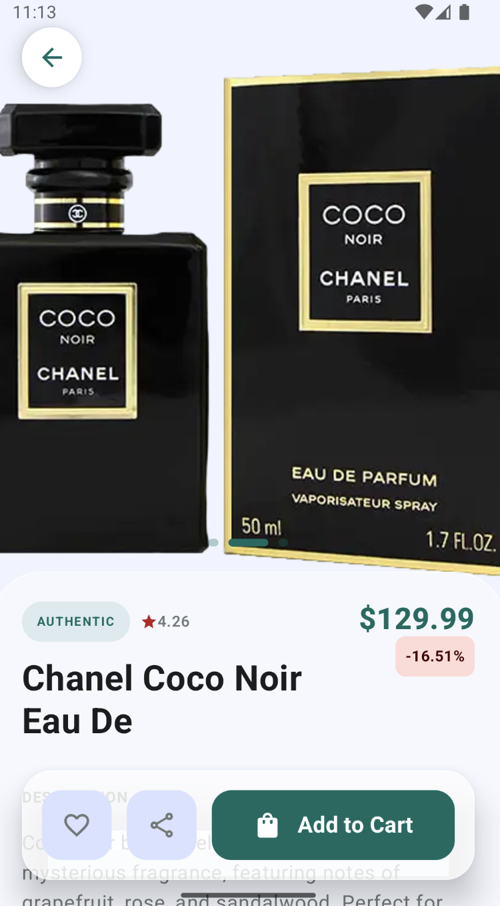
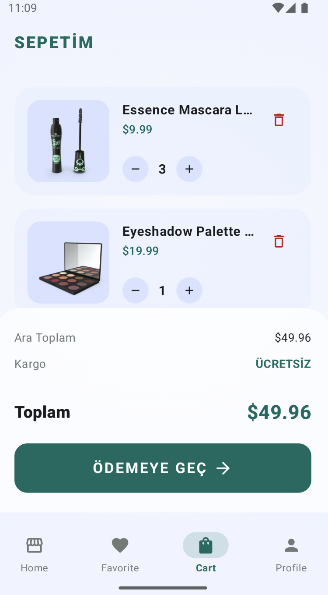
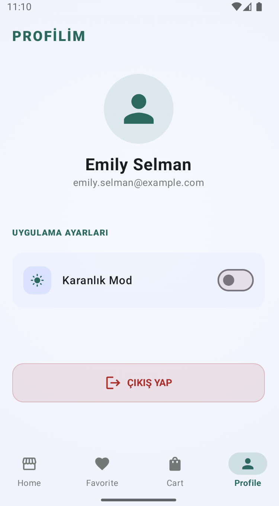
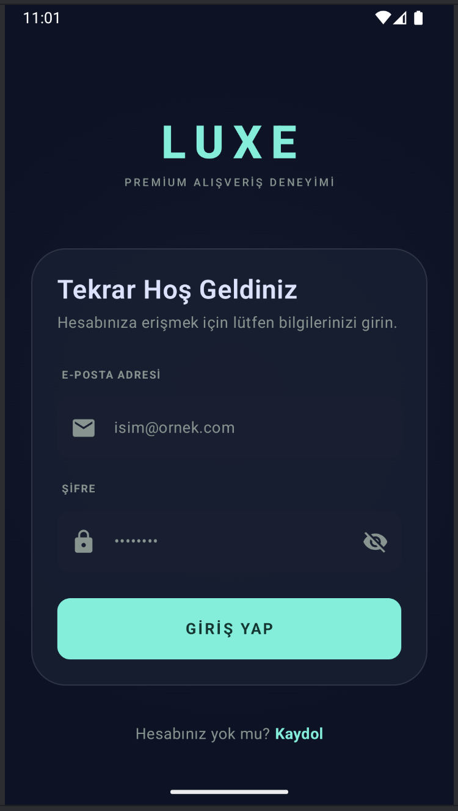
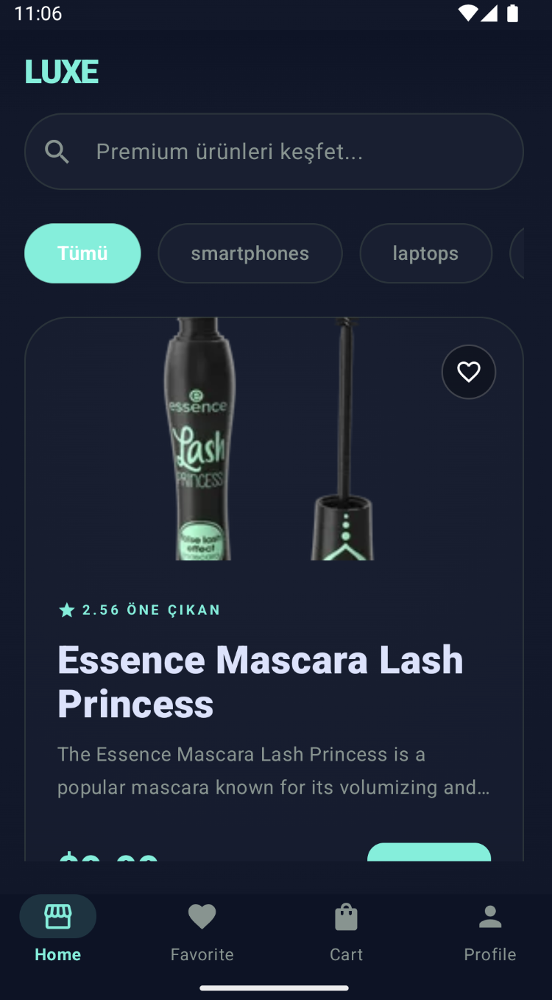
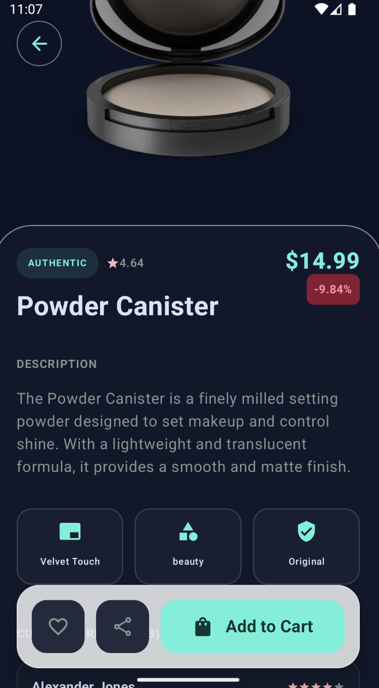
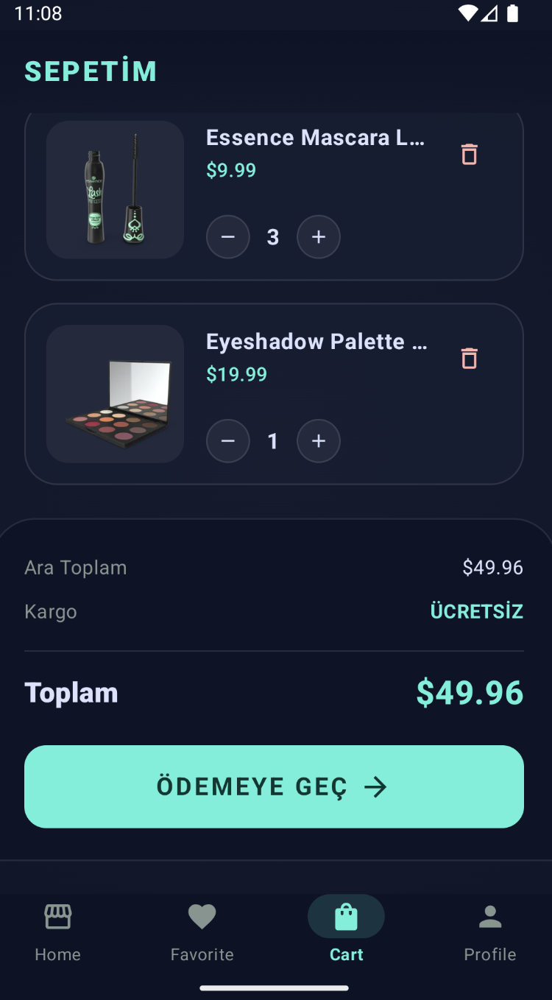
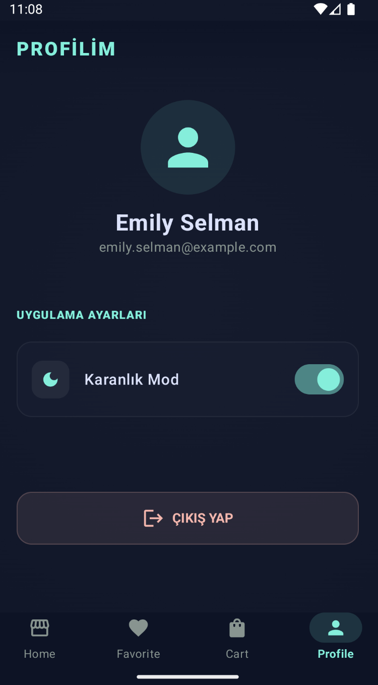

# 🛍️ Luxe Shop App

**Luxe Shop App**, modern Android geliştirme pratikleri ile inşa edilmiş, "Offline-First" (Önce Çevrimdışı) felsefesini benimseyen, premium tasarımlı bir e-ticaret uygulamasıdır.

---

## ✨ Özellikler

- **Premium UI/UX:** Glassmorphism etkileri, dinamik gradyanlar ve modern tipografi.
- **Dinamik Tema:** Tam uyumlu Karanlık ve Aydınlık mod desteği.
- **Yerel Veri Yönetimi:** Sepet ve Favoriler için Room ile çevrimdışı erişim.
- **Gelişmiş Sepet Yönetimi:** Ürün ekleme, miktar güncelleme ve senkronizasyon.
- **Akıllı Arama:** Kategorilere göre filtreleme ve anlık ürün arama.

---

## 🛠️ Teknoloji Yığını & Nedenleri

Uygulama, ölçeklenebilir ve sürdürülebilir olması için şu teknolojilerle inşa edilmiştir:

- **Jetpack Compose:** Modern ve esnek bir UI katmanı oluşturmak için.
- **Hilt (Dagger):** Bağımlılık yönetimi (Dependency Injection) ile kodun test edilebilirliğini artırmak için.
- **Retrofit & OkHttp:** REST API iletişimini güvenli ve performanslı yönetmek için.
- **Room Database:** Kullanıcı verilerini (Sepet/Favori) yerel cihazda kalıcı tutmak için.
- **Kotlin Coroutines & Flow:** Asenkron veri akışlarını ve UI güncellemelerini yönetmek için.
- **Coil:** Resimlerin bellek dostu bir şekilde yüklenmesi ve önbelleğe alınması için.

---

## 🌐 Veri Kaynağı

Uygulama, farklı işlevler için iki farklı API servisi kullanmaktadır:

- **Ürün Yönetimi:** [DummyJSON](https://dummyjson.com) (`/products`, `/products/search`)
- **Kimlik Doğrulama:** [ReqRes](https://reqres.in) (`/api/login`, `/api/register`)

---

## 🚀 Kurulum

1. Bu projeyi klonlayın:
   ```bash
   git clone https://github.com/ServetErdogan09/ShopApp.git
   ```
2. Android Studio (Ladybug veya sonrası) ile projeyi açın.
3. Bağımlılıkların yüklenmesi için projenin senkronize olmasını bekleyin.
4. Bir emülatör veya fiziksel cihazda çalıştırın.

---

## 📸 Ekran Görüntüleri

### ☀️ Aydınlık Mod
| Giriş Yap | Ana Sayfa | Ürün Detay | Sepetim | Profil |
| :---: | :---: | :---: | :---: | :---: |
|  |  |  |  |  |

### 🌙 Karanlık Mod
| Giriş Yap | Ana Sayfa | Ürün Detay | Sepetim | Profil |
| :---: | :---: | :---: | :---: | :---: |
|  |  |  |  |  |

> **Not:** Uygulama içerisindeki görseller dinamik API'den çekilmektedir.

---

## 👤 İletişim

**Servet Erdoğan** - [GitHub](https://github.com/ServetErdogan09)

---
*Bu proje eğitim ve portfolyo amaçlı geliştirilmiştir.*
